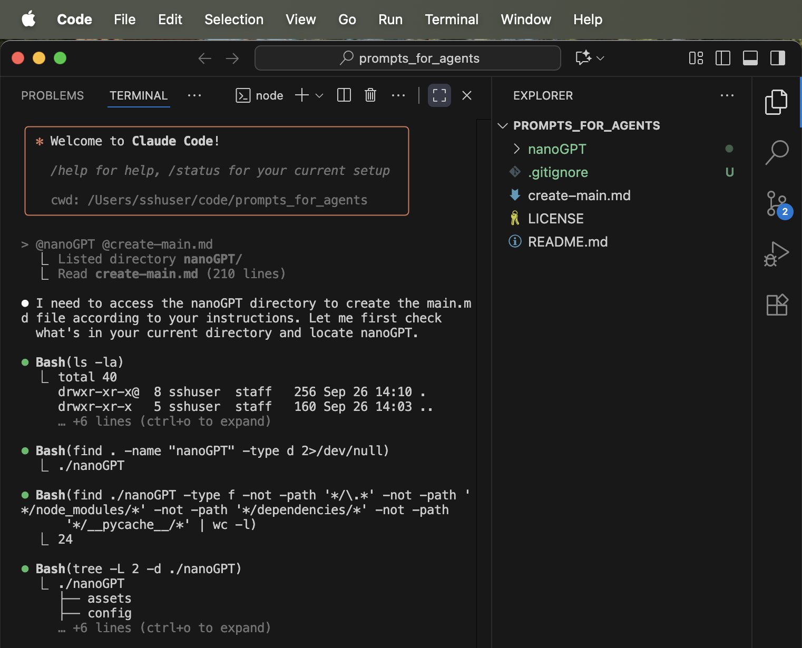
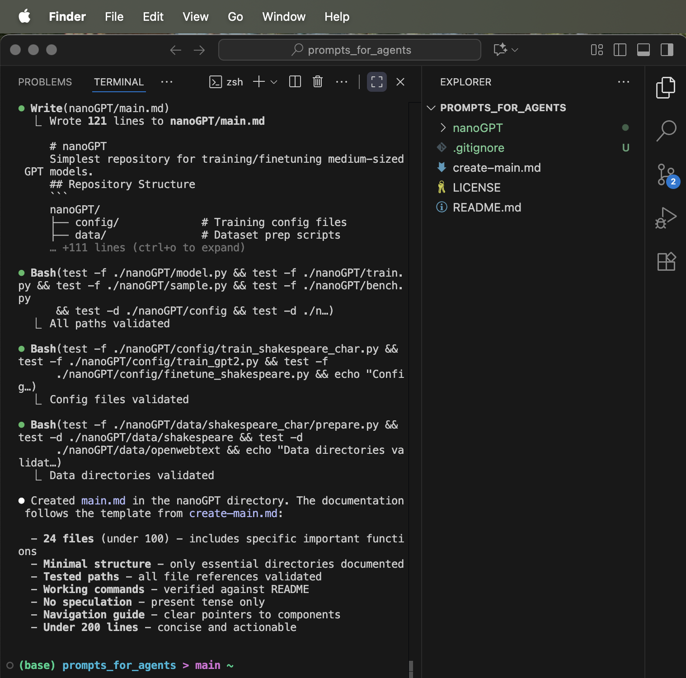
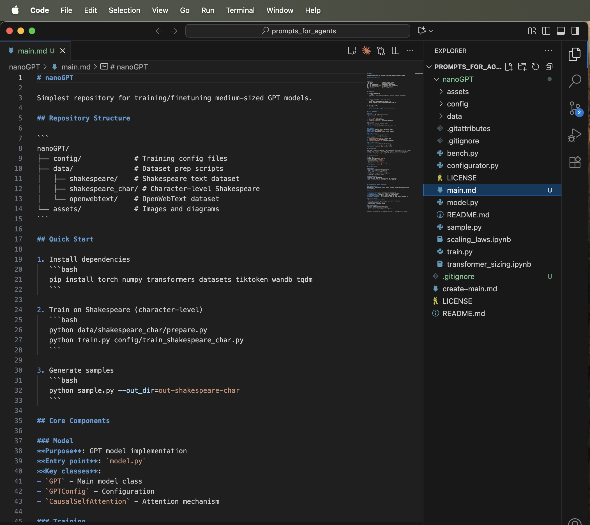

# create-main-md

Drop `create-main.md` into any repository. AI agent creates a `main.md` navigation document.

## Example: nanoGPT

<table>
<tr>
<td></td>
<td></td>
</tr>
</table>

Generated [`main.md`](nanoGPT_example_main.md) helps AI agents navigate nanoGPT without asking questions.

